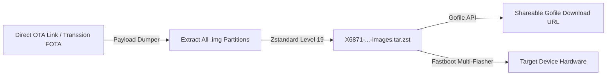

# Transsion Firmware Toolkit 🚀

[](https://github.com/sheikhmehraann/Transsion-Firmware-Toolkit/actions)
[](https://opensource.org/licenses/Apache-2.0)
[](https://www.python.org/)
[](https://facebook.github.io/zstd/)

> **The Ultimate All-in-One Firmware & OTA Toolkit for Transsion (Infinix, TECNO, itel) & MediaTek Android Devices.**
> 
> *Dedicated to and honoring the pioneering reverse engineering work of **Rama Bondan Prakoso** ([@ramabondanp](https://github.com/ramabondanp) / [`rama982`](https://forum.xda-developers.com/m/rama982.9099884/)).*

---

## 📖 Overview

The **Transsion Firmware Toolkit** provides a complete, unified suite for probing, downloading, extracting, reconstructing, patching, and flashing firmware for Android smartphones produced by Transsion Holdings (**Infinix**, **TECNO**, **itel**) and MediaTek chipsets (Helio G80/G95/G99 and Dimensity 8200/8300/9000).

It brings together Rama Bondan Prakoso's reverse-engineered protocols and tools into one streamlined CLI and automation framework:

1. 🌐 **1-Click OTA URL to `.tar.zst` & Gofile Upload**: Feed any direct OTA download link → automatically dumps all partition `.img` files (`boot`, `init_boot`, `vendor_boot`, `dtbo`, `vbmeta`, `system`, `vendor`, `product`, `odm`) → compresses into `X6871-...-images.tar.zst` using Zstandard level 19 → uploads directly to **Gofile** with a shareable high-speed link.
2. 🔍 **Protobuf OTA Prober**: Query official FOTA / Google Check-in servers for new incremental or full firmware `.zip` update links.
3. 📦 **Full & Incremental Payload Extraction**: Extract raw partition `.img` files from `payload.bin`, and reconstruct byte-accurate updated images from incremental delta diffs.
4. 🗜️ **Rama-Style `.tar.zst` Packager**: Generate high-ratio, ultra-fast decompressing `X6871-...-images.tar.zst` packages matching official releases on SourceForge.
5. ⚡ **Multi-Partition Fastboot Flasher**: Cross-platform flash engine supporting logical dynamic super partitions (`system`, `vendor`, `product`, `odm`) in `fastbootd`.
6. 🛠️ **64-Bit Vendor Converter**: Automatically convert 32/64-bit hybrid Transsion vendor trees to pure 64-bit only (`arm64-v8a`) to eliminate bootloops on Generic System Images (GSI).
7. ☁️ **Automated GitHub Actions Cloud Extractor**: Run the pipeline directly in GitHub Actions with 10Gbps cloud bandwidth with zero local download needed.

---

## 🛠️ Architecture & Workflow



---

## 📱 Hardware & Target Devices Supported

| Brand | Model Codename | Market Name | Chipset Platform |
| :--- | :--- | :--- | :--- |
| **Infinix** | `X6871` / `X6871B` | **Infinix GT 20 Pro** | MediaTek Dimensity 8200 Ultimate |
| **Infinix** | `X6739` | **Infinix GT 10 Pro** | MediaTek Dimensity 8050 |
| **Infinix** | `X6833B` | **Infinix Note 30 VIP** | MediaTek Dimensity 8050 |
| **Infinix** | `X6711` | **Infinix Note 40 Pro+ 5G** | MediaTek Dimensity 7020 |
| **Infinix** | `X695C` | **Infinix Note 10 Pro (ID)** | MediaTek Helio G95 |
| **Infinix** | `X6815` | **Infinix Zero 5G** | MediaTek Dimensity 900 |
| **TECNO** | `KJ7` | **TECNO Spark 20 Pro+** | MediaTek Helio G99 Ultimate |
| **TECNO** | `LH8n` | **TECNO Pova 5 Pro 5G** | MediaTek Dimensity 6080 |
| **TECNO** | `CK7n` | **TECNO Camon 20 Pro 5G** | MediaTek Dimensity 8050 |
| **TECNO** | `AD10` | **TECNO Phantom V Fold** | MediaTek Dimensity 9000+ |

---

## 🚀 Installation

```bash
# Clone the repository
git clone https://github.com/sheikhmehraann/Transsion-Firmware-Toolkit.git
cd Transsion-Firmware-Toolkit

# Install dependencies
pip install -r requirements.txt
```

---

## 💻 Usage & Commands

### 🌟 1. OTA Link directly to `.tar.zst` and Gofile (1-Click)
```bash
# Downloads OTA, extracts all .img files, packs X6871-...-images.tar.zst, and uploads to Gofile
python main.py ota-to-gofile "https://fota-cdn.transsion.com/ota/X6871/15.1.2.180SP05/update.zip" --name "X6871-15.1.2.180SP05-OP001PF001AZ-images.tar.zst"
```

### 2. View Supported Devices
```bash
python main.py devices
```

### 3. Probe OTA Updates for a Device
```bash
# Probe updates for Infinix GT 20 Pro
python main.py probe -m X6871

# Probe updates for Tecno Spark 20 Pro+
python main.py probe -m KJ7
```

### 4. Extract Full OTA Package Locally
```bash
# Extract partition images from OTA .zip
python main.py extract ota_update.zip -o ./extracted_images/
```

### 5. Pack Images into Rama-Style `.tar.zst`
```bash
# Compress extracted partition images into high-ratio Zstandard tarball
python main.py pack ./extracted_images/ -o X6871-15.1.2.180SP05-OP001PF001AZ-images.tar.zst -l 19
```

### 6. Upload any `.tar.zst` or File to Gofile
```bash
python main.py upload-gofile X6871-15.1.2.180SP05-OP001PF001AZ-images.tar.zst
```

### 7. Flash Extracted Firmware via Fastboot
```bash
# Automatically flashes boot partitions, enters fastbootd, and flashes dynamic super partitions
python main.py flash ./ready_to_flash/
```

---

## ⚡ Flashing Guide for Infinix GT 20 Pro (`X6871`)

When flashing custom recoveries or extracted partition packages on the **Infinix GT 20 Pro**:

1. **Flash Recovery / Boot**:
   ```bash
   fastboot flash vendor_boot vendor_boot.img
   fastboot flash boot boot.img
   fastboot flash init_boot init_boot.img
   ```
2. **Important Booting Instruction**:
   > ⚠️ **DO NOT run `fastboot reboot recovery`!** 
   > Instead, power down the device and hold **Power + Volume Up** physically to trigger recovery mode.

---

## 🤝 Credits & Acknowledgements

- **Rama Bondan Prakoso** ([@ramabondanp](https://github.com/ramabondanp) / [`rama982`](https://forum.xda-developers.com/m/rama982.9099884/)): For pioneering Transsion OTA probing, Genom Kernel, MT6789 flasher scripts, and 64-bit vendor porting guides.
- **AOSP / update_engine team**: For delta generator and payload specifications.
- **Gofile.io**: For ultra-fast free cloud file delivery.

---

## 📄 License

Licensed under the **Apache License, Version 2.0**. See the [`LICENSE`](LICENSE) file for details.
